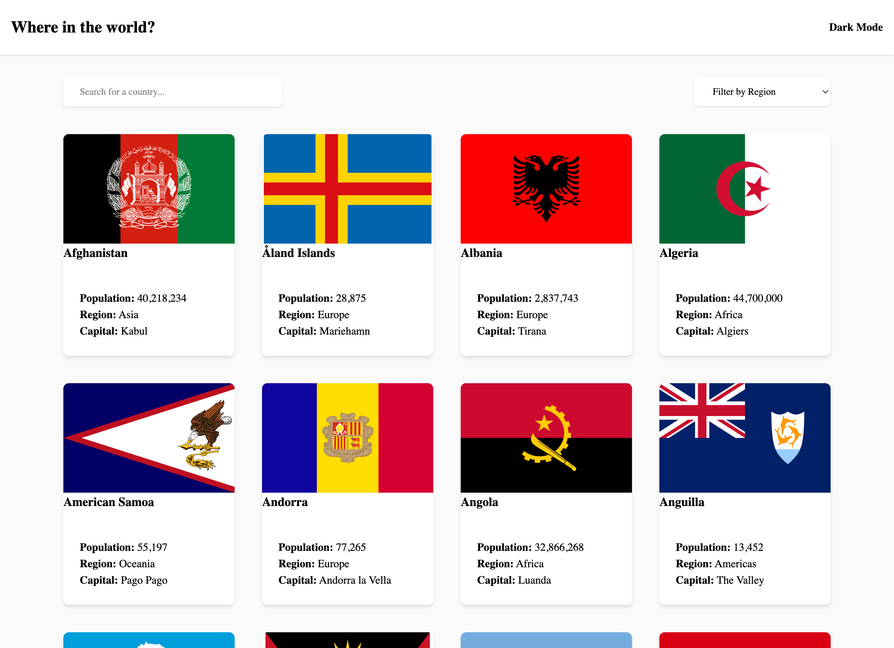

# Frontend Mentor - REST Countries API with color theme switcher solution

This is a solution to the [REST Countries API with color theme switcher challenge on Frontend Mentor](https://www.frontendmentor.io/challenges/rest-countries-api-with-color-theme-switcher-5cacc469fec04111f7b848ca). Frontend Mentor challenges help you improve your coding skills by building realistic projects. 

## Table of contents

- [Overview](#overview)
  - [The challenge](#the-challenge)
  - [Screenshot](#screenshot)
  - [Links](#links)
- [My process](#my-process)
  - [Built with](#built-with)
  - [What I learned](#what-i-learned)
  - [Useful resources](#useful-resources)
- [Author](#author)

## Overview

### The challenge

Users should be able to:

- See all countries from the API on the homepage
- Search for a country using an `input` field
- Filter countries by region
- Click on a country to see more detailed information on a separate page
- Click through to the border countries on the detail page
- Toggle the color scheme between light and dark mode *(optional)*

### Screenshot

### Links

- Solution URL: [https://github.com/essencenroberts/rest-countries-api]
- Live Site URL: [https://restcountriesapi2026.netlify.app/]

## My process

### Built with

- Semantic HTML5 markup
- Vite
- TypeScript
- Tailwind CSS v4
- Mobile-first workflow
- [REST Countries API](https://restcountries.com) (v5, authenticated)

### Architecture Decisions
This project pulls country data from two different places:

  - **Homepage** reads from a local `data.json` file within the project. It loads instantly.
  - **Detail page** fetches live from the REST Countries API when a user clicks a country card, using the country's alpha-3-code rather than its name.

  I defined to separate TypeScript types for the project: Country for the homepage list and CountryDetail for the live API response

  I created the custom error classes (` ApiRequestError`, `CountryNotFoundError` ) to distinguish between a failed network request and a request that worked but found nothing.

### What I learned

I got real practice working with PAI that requires authentication from the browser, environment variables in VITE (import.meta.env.VITE_*), and the specific CORS behavior of allowlisted origins.

A few times I typed a field a caertain way based on what i assumed the API would return, and it turned out to be wrong. For example, I assumed `currencies` and `langiages` were objects but they're actually arrays. I only caight this by logging a real response from the API and comparing it side by side with what I had written.

### Useful resources

- [MDN - Using the Fetch API](https://developer.mozilla.org/en-US/docs/Web/API/Fetch_API/Using_Fetch) - Explains why `fetch()` doesn't reject on a bad status code (like a 404) and why you have to check `response.ok` yourself
- [MDN - Using the Fetch API](https://developer.mozilla.org/en-US/docs/Web/API/Fetch_API/URLSearchParams) - used this to read the `?code=BEL` part off the URL on the dtail page instead of writing my own string-splitting logic.
- [TypeScript Handbook - Everyday Types](https://www.typescriptlang.org/docs/handbook/2/everyday-types.html) - helped to refresh on interfaces, optional properties (`?`), and union types
- [Tailwind CSS v4 docs - Dark mode](https://www.tailwindcss.com/docs/dark-mode) -this is what showed me i needed the `@custom-variant dark` in my CSS for toggle to work

## Author

- Website - [Essence](https://essence-portfolio.netlify.app/)
